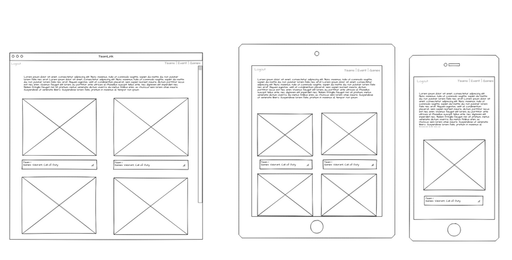

# Marketplace Documentation

### Github: https://github.com/NathanEwan02/Marketplace_App

### Deployed Website: https://teamlinkapp.herokuapp.com/users/sign_in   

## Purpose and Target Audience
The mission of TeamLink is to provide esport team managers/organizers with a platform that allows them to connect with new recircuits. Though there are existing websites that connect users with managers, there aren’t any spaces for smaller and amateur teams to connect on a single platform. TeamLink will aim to provide its players with a place to seek out events and teams to be recruited by or join a local team for friendly competitions. The target audience of my application are esports team managers, competitive players and event organizers and is more focused on more amateur teams.   

## Problem
The main problem TeamLink aims to solve is the shortage of opportunities that talented esports players have when wanting to join a competitive esports team. The esports community is dominated by a small collective of very successful esports teams which results in a high barrier to entry and limited positions. This leads to a lack of competition and stifles the growth of the industry as a whole. An additional problem is that there aren’t many websites or applications that provide a platform for team managers and new players connected easily. Though there are plenty of web apps that allow users to seek out managers, there aren’t many who are focus on the esports community specifically. 

My marketplace application TeamLink will solve this issue by allowing team managers and players to connect with one another. Managers will have a place to set up a new or existing team and create events for recruiting or local tournaments. The esporst players will now have a space to make a name for themselves within the esports community. Finally, the organizers and owners of stadiums and locations will be able to create and host events for teams and players.   

## Functionality and Features

### **User authentication:**
-	The website will have a user authentication system through the use of the ‘Devise’ ruby gem. This will ensure that user data and accounts cannot be stolen or hijacked by unwanted people. This is done through the use of user emails and password encryption which ensures that the person using an account is who they say they are.

### **User authorization:**
-	Authorization has been implemented through the use of user roles and the ruby ‘Pundit’ gem. This prevents unauthorized access to specific resources and limits the availability of that resource to a specific user or users. Within the ‘roles’ model there are three types of roles/access permissions which are, player, manager, and organizer. The manager role has access to create both events and teams as well as edit and delete their own team or event but not others. The organizer role is similar to the manager role however they are unable to create or edit teams and are instead restricted to creating, editing and deleting events. 

### **Mangers:**
-	If a user assigns themselves as a manager, they are then able to create a multiple teams and multiple events. The reason why managers are aloud to create events and not just the organizers, is to provide team managers with the option to set up an event with only their team competing. This can then be used as a way for managers to create tryouts/recruiting events for new player to join their team. Team managers also have the ability to update and delete teams, though this access will be restricted to only teams that they themselves have created. They will have the ability to set an image/logo, create a team name, add players, and add games.

### **Organizers:**
-	The event organizers are able to create events and set attributes such as date, location, name, games that will be played, and teams that may be going. The role of the organizer is someone who sets up events, and for that reason they are unable to create teams unlike team managers. Event organizers are also able to edit and delete the details and attributes of the events that they themselves have created but not the events of other organizers.

### **Players:**
-	The player role if automatically applied to all users once they have created an account. Users are unable to create, edit or delete any events or teams unless they have already chosen that role. The players will be able to view all teams and the details of those teams as well as any upcoming events and their details. The player role is made to allow for any player to apply/register for an event or events.   

## Sitemap
  

## Tech Stack

### **Frontend**
-	The frontend of this application operates using HTML and CSS. The HTML is used to display the necessary information to each of the website’s pages while the CSS handled the styling of the HTML elements in order to make it look more presentable.

### **Backend**
-	The backend of the application uses Ruby and an MVC gem called Ruby on Rails. The Rails MVC framework separates the application into models, views, and controllers. The models establish the relationship between other models, have direct access to the database and handle the validation of the data. The views are the HTML and CSS that gets displayed to the browser of the user when requesting a page, this also incudes the use or ERB (Embedded Ruby) which is a way of using ruby code in html tags. Finally, the controllers are what facilitate the actions between models and views. They can be seen as the brains behind the MVC framework.

### **Database**
-	The database used for this application was PostgreSQL. Postgres is an open-source relational database model built on the SQL language. It is a cross platform software, that is both reliable and easy to use. Rails has also added plenty of support for Postgres features such as backing Rails Active Record models, making an efficient choice for Ruby on Rails development. The use of Postgres in the development of this application crucial for developing relations between models and entities and storing that data in an efficient and secure location rather than in seeds files.

### **Deployment**
-	Deployment of the application was handled using Heroku. Heroku is a third-party service which provides free hosting of websites and webapps for its users so that they can deploy, manage, and expand upon their application. The built-in use of Heroku’s git workflow allows for new changes and updates to be easily pushed to the live site and allows developers to continue development locally while the site is live.   

## Third party services
### **Cloudinary**
-	Cloudinary is a cloud storage system for images and prevents the developer from needing to store the images locally or on Heroku. This prevents images from taking up unnecessary space on the website. 

### **Heroku**
-	As mentioned previously, Heroku has been used for the deployment of the site using Heroku’s hosting services. This application is using Heroku’s free service for smaller projects (500MB) for deployment. 

### **Github**
-	 Github is a cloud-based service that allows developers to store and update their code and files. It operates using git control flow and allows users to make changes to code locally and then later commit that code to the main/master branch of the repository. Github has been used heavily throughout the development of this application and has made management of the workflow much simpler, as everything can tracked and traced back to see prior changes.   

## User Stories

### **Players:**
-	I should be able to view all teams so that I am able to see and pick what teams I would like to join
-	As a player I want to have access to the information of each team so that I can decide which one best suit me
-	As a player I should have access to see all the available and upcoming events to decide which I am able to attend.
-	I want to see the date, location and teams competing in the event so that I am able to decide if I want to attend
-	As a player I want the ability to apply for an event so that organizers/managers will know that I will be participating

### **Organizers:**
-	As an organizer I must be able to create new events so that players wanting to attend can see and apply for them
-	As an organizer I need the ability to create multiple events so that I am not limited to one event and can return to make more
-	Organizers should be able to make changes to our events in order to fix mistakes or update details
-	As an organizer only the one who has created the event should be able to make changes to it, to prevent other organizer form modifying the event whether intentionally or unintentionally
-	I need set up a date, location, and teams to my events so that players know when and where the event is, as well as what teams are participating

### **Managers:**
-	 As a manager I want players to see the teams I have created so that players can decide if they want to join them
-	As a manager I want players to see the events I have created so they know when we are recruiting new player
-	As a manager I only want me to edit and delete the teams and events I have created so that no other person can manipulate my team and events
-	I must have the ability to create a name and set up player so that future player knows what team I represent   

## Wireframes

  

## ERD
   

## High level Abstraction
### **User:**
-	The purpose of the user model is to provide the users of an application with a way of authenticating themselves once they attempt to use the application. The User has an email, username, password, password confirmation and a role. The email is used because if a user ever forgets their password, then they can be authenticated through the use of their email address and allows for managers and organizer the opportunity to communicate with them. The username is unique and is used as a way of distinguishing between different user, especially since esports player go by their usernames. The password and password confirmation both obviously help in ensuring authentication and that the user didn’t miss type their password on accident. Finally, the roles help distinguish what a user is authorized to access. 

### **Roles:**
-	The roles model is used to establish the different types of authorization any one user might have. The model consists of the role_id and its name. The names included in the model are the manager, player, and organizer. The task of the Role model is defined what a user with each type of role has access to. The player is someone who is looking to use the application to find teams to play for and events to participate in. The organizer is looking to create and host events, while the manager is looking to create a team as well as host events/recruitments for that team.

### **Events:**
-	Events are created and hosted by either a team manager or an organizer. This person is able to create more than one event and can set attributes such as date location, and teams competing in the event. This then allows players to seek out recruitments to teams or a spot in an event by applying for that event.

### **Teams:**
-	Teams are created by team managers and can be edited and deleted by the manager who has created them. A team manager would be able to set the name, players, and games that those players play as attributes in this entity. The teams can be viewed by every user and allows players browse and see teams they may want to join or compete against.

### **Games:**
-	Games are what help to define a team. A team can play and compete in multiple games and an event can host a single game.   

## Project Models and Database Relationships
### **User model:**
The user table within the Postgres database and the Rails models have associations with the roles, teams, games, and events tables/entities. Some of these assosications are done through joining tables such as user games, user roles, and event users. These join tables allow for many to many associations to occur. These tables each contain a foreign key from the users table and a foreign key from the other table it references. To combine them they are referenced using the primary key of that joining table for example, event_user_id. As for the association between users teams, there are two. The first of which is a one to many, meaning that a team can have optionally many users and a user can have optionally one team. The second relationship is a ‘bi-directiona’l one meaning there is a foreign key within the team table labeled as manager_id which refers to the user_id of the user that created that team. There is also a bi-directional relationship with events which works in a similar way however is called creater_id and refers to the creator of that event.

-	The user `has_many` roles `through` user_roles
-	A user `has_many` games `through` user_games
-	The user `has_many` events `through` event_users
-	A user `has_one` team
-	A user (FK manager ) `has_many` teams, a team `belongs_to` a manger
-	A user (FK organizer ) `has_many` events, an event `belongs_to` an organizer

### **Roles model:**
The role table contains the type of roles that can be assigned to a user. This many to many relationships is established through the user roles joining table which contains the foreign keys from the two tables.

-	A role `has_many` users `through` user_roles

### **Team model:**
The team model and table is connected to user, event, and game tables. The game entity is a many to many relationships through the team games table, and the team event table is linked to both the teams and events tables using their foreign keys. There is a many to one relationship between user and team which means a team can have many user and a user can belong to one team. The final relationship is a bi-directional one between users and teams which signifies that a user is the manager of a team using the foreign key manger_id in the team table.

-	A team `has_many` users
-	A team `has_many` events `through` team_events
-	A team `has_many` games `through` team_games

### **Game model:**
The game entity in PostgreSQL is related to the team and user tables, each done through a joining table. The relation from game to event however is a many to one, meaning that many events have a single event tied to them and a game can have many events.

-	A game `has_many` teams `through` team_games
-	A game `has_many` events
-	A game `has_many` users `through` user_games

### **Event model:**

The event table in Postgres is related to the user table in two separate ways, one is through a many to many in a joining table called event users, which indicates that a user can have multiple events and vise versa. The other relation is done using a bi-directional relation so that an event has a user tied to it which indicates the user id of the user that created the event. As for the other joining table, there is one called team events that is used to link the foreign keys of both the event and team model. Finally, there is the relation between game and events used to show that an event has one game and a game can have multiple events.

-	An event `has_one` game
-	An event `has_many` teams `through` team_events
-	An event `has_many` user `through` event_users   

## Database schema design
A detailed overview of the relationships, types of relationships, tables/entities, and fields have already been covered in the ERD, and the ‘project model and database relationships’ sections of this document. However due to constraints of the software used to create the ERD, the diagram is lacking in additional information such as data types and data constraints. As a result, this section will further clarify these pieces of information for each table/entity.

### **User table:**
-	user_id, integer, primary key, not null
-	username, string, unique, not null
-	email, string, unique, not null
-	password, hash, not null

### **Role table:**
-	role_id, integer, primary key, not null
-	name, string, not null

### **User Role table:**
-	user_role_id, integer, primary key, not null
-	user_id, integer, foreign key, not null
-	role_id, integer, foreign key, not null

### **Team table:**
-	team_id, integer, primary key, not null
-	name, string, not null
-	manager_id, integer, foreign key

### **Event table:**
-	event_id, integer, primary key, not null
-	name, string, not null
-	date, datetime, not null
-	location, string, not null
-	game_id, integer, foreign key, not null
-	creator_id, integer, foreign key, not null

### **User Event table:**
-	user_event_id, integer primary key, not null
-	user_id, integer, foreign key, not null
-	event_id, integer, foreign key, not null

### **Team Event table:**
-	team_event_id, integer, primary key, not null
-	team_id, integer, foreign key, not null
-	event_id, integer, foreign key, not null

### **User Games table:**
-	user_game_id, integer, primary key, not null
-	user_id, integer, foreign key, not null
-	game_id, integer, foreign key, not null

### **Team Games table:**
-	team_game_id, integer, primary key, not null
-	team_id, integer, foreign key, not null
-	game_id, integer, foreign key, not null

### **Games table:**
-	game_id, integer, primary key, not null
-	name, string,   

## Project Management
The planning of the project management began with devising ideas for the app, creating the ERD and deciding on the functionality and features of the app. The beginning stages of development utilized a combination of sticky notes and Trello to track and manage the app. Below is the link to the Trello board and parts of the project that were tracked. 

https://trello.com/b/MNzgiLmV/marketplace-app
